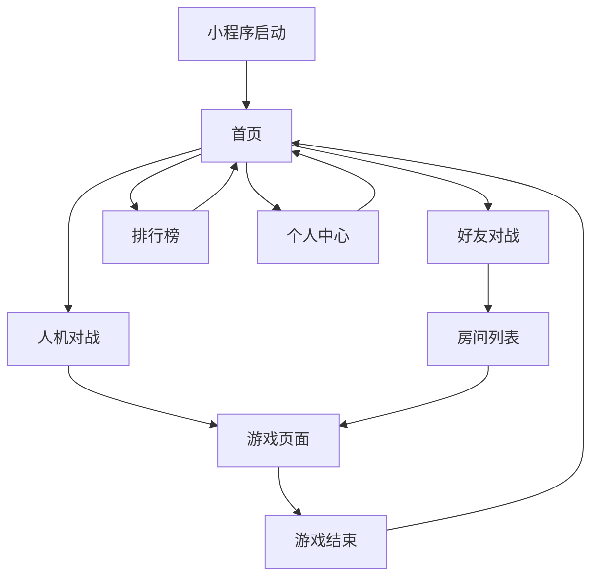

## 1. 产品概述

微信五子棋小程序是一款基于微信平台的轻量级棋类游戏应用，用户无需下载安装即可快速体验五子棋对弈乐趣。

* 支持人机对战和好友对战模式，提供智能AI对手和社交互动体验

* 面向广大微信用户群体，特别是喜爱棋类休闲游戏的用户，提供随时随地的娱乐体验

## 2. 核心功能

### 2.1 用户角色

| 角色   | 注册方式   | 核心权限               |
| ---- | ------ | ------------------ |
| 游客用户 | 微信授权登录 | 人机对战、查看排行榜         |
| 注册用户 | 微信自动注册 | 人机对战、好友对战、战绩记录、排行榜 |

### 2.2 功能模块

我们的五子棋小程序包含以下主要页面：

1. **首页**：游戏模式选择、快速开始、个人战绩展示
2. **游戏页面**：棋盘对弈、AI对手、游戏设置、悔棋功能
3. **好友对战页面**：创建房间、加入房间、实时对战
4. **排行榜页面**：全服排名、好友排名、个人战绩
5. **个人中心**：用户信息、游戏统计、设置选项

### 2.3 页面详情

| 页面名称   | 模块名称    | 功能描述                    |
| ------ | ------- | ----------------------- |
| 首页     | 游戏模式选择  | 提供人机对战、好友对战、快速匹配三个入口按钮  |
| 首页     | 个人战绩卡片  | 显示胜率、对局数、连胜记录等关键数据      |
| 首页     | 排行榜入口   | 快速跳转到排行榜页面的按钮           |
| 游戏页面   | 15x15棋盘 | 标准五子棋棋盘，支持触控落子，显示当前落子位置 |
| 游戏页面   | 游戏状态栏   | 显示当前轮到谁、已用时间、悔棋按钮       |
| 游戏页面   | AI难度选择  | 提供简单、中等、困难三个AI难度等级      |
| 游戏页面   | 游戏控制    | 重新开始、认输、返回首页等功能按钮       |
| 好友对战页面 | 房间管理    | 创建房间、输入房间号加入、分享房间       |
| 好友对战页面 | 在线状态    | 显示好友在线状态、邀请好友对战         |
| 排行榜页面  | 排行榜切换   | 全服总榜、好友榜、周榜等分类切换        |
| 排行榜页面  | 排名列表    | 显示排名、昵称、胜率、对局数等信息       |
| 个人中心   | 用户信息    | 微信头像、昵称、游戏等级、经验值        |
| 个人中心   | 游戏统计    | 总对局数、胜率、最高连胜、历史战绩       |
| 个人中心   | 设置选项    | 音效开关、落子动画、棋盘主题等个性化设置    |

## 3. 核心流程

### 3.1 人机对战流程

用户进入小程序 → 选择人机对战 → 选择AI难度 → 开始游戏 → 用户执黑先行 → 轮流落子 → 胜负判断 → 游戏结束 → 显示结果 → 返回首页/重新开始

### 3.2 好友对战流程

用户A创建房间 → 分享房间号给好友 → 用户B输入房间号加入 → 双方准备 → 开始对战 → 实时同步棋局 → 胜负判断 → 游戏结束

### 3.3 页面导航流程

## 4. 用户界面设计

### 4.1 设计风格

* **主色调**：传统棋盘风格，深棕色(#8B4513)搭配米白色(#F5F5DC)

* **按钮样式**：圆角矩形，采用微信绿色(#07C160)作为主操作按钮色

* **字体选择**：微信小程序默认字体，标题18px，正文14px

* **布局风格**：卡片式布局，上下结构，顶部导航栏+内容区域

* **图标风格**：线性图标，简洁明了，符合微信小程序设计规范

### 4.2 页面设计概述

| 页面名称 | 模块名称   | UI元素                      |
| ---- | ------ | ------------------------- |
| 首页   | 顶部导航   | 小程序标题居中，右侧设置按钮，背景为木纹质感    |
| 首页   | 游戏模式卡片 | 三个大卡片横向排列，每个卡片有对应图标和简短描述  |
| 游戏页面 | 棋盘区域   | 居中显示15x15网格棋盘，网格线清晰，交叉点明显 |
| 游戏页面 | 控制面板   | 底部固定栏，包含悔棋、认输、设置等操作按钮     |
| 排行榜  | 榜单切换   | 顶部Tab栏，当前选中项高亮显示          |
| 个人中心 | 信息卡片   | 顶部用户信息显示区域，包含头像、昵称、等级     |

### 4.3 响应式设计

* **适配原则**：以iPhone 6/7/8 (375x667)为基准设计，适配各种手机屏幕

* **触摸优化**：按钮最小点击区域44x44px，棋盘格子大小适配手指触摸

* **横竖屏**：默认竖屏模式，游戏页面支持横屏获得更好体验

* **全面屏适配**：考虑刘海屏、底部安全区域，确保内容不被遮挡

