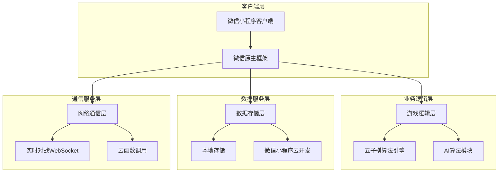

## 1. 架构设计



## 2. 技术描述

### 2.1 核心技术栈
- **前端框架**: 微信小程序原生框架 + WXML/WXSS/JS
- **样式框架**: 微信小程序原生WXSS + 自定义样式
- **构建工具**: 微信开发者工具
- **状态管理**: 小程序原生Page.data + 全局App数据
- **数据存储**: 微信小程序云开发 (CloudBase) + 本地Storage
- **实时通信**: WebSocket (用于好友对战)

### 2.2 开发工具
- **IDE**: 微信开发者工具
- **调试**: 微信开发者工具真机调试
- **版本管理**: Git + 微信小程序代码管理

## 3. 路由定义

| 页面路径 | 页面名称 | 功能描述 |
|----------|----------|----------|
| /pages/index/index | 首页 | 小程序入口，游戏模式选择 |
| /pages/game/game | 游戏页面 | 人机对战主界面 |
| /pages/multiplayer/multiplayer | 好友对战 | 创建/加入房间界面 |
| /pages/room/room | 房间页面 | 实时对战界面 |
| /pages/rank/rank | 排行榜 | 显示各类排行榜 |
| /pages/profile/profile | 个人中心 | 用户信息和设置 |
| /pages/settings/settings | 设置页面 | 游戏设置选项 |

## 4. 核心算法设计

### 4.1 五子棋游戏逻辑
```javascript
// 棋盘状态管理
class GobangGame {
  constructor() {
    this.board = Array(15).fill().map(() => Array(15).fill(0)); // 0: 空, 1: 黑子, 2: 白子
    this.currentPlayer = 1; // 黑子先行
    this.gameStatus = 'playing'; // playing, finished
    this.winner = null;
  }
  
  // 落子逻辑
  makeMove(row, col, player) {
    if (this.board[row][col] !== 0 || this.gameStatus !== 'playing') {
      return false;
    }
    
    this.board[row][col] = player;
    
    // 检查胜负
    if (this.checkWin(row, col, player)) {
      this.gameStatus = 'finished';
      this.winner = player;
      return 'win';
    }
    
    // 检查平局
    if (this.isBoardFull()) {
      this.gameStatus = 'finished';
      return 'draw';
    }
    
    this.currentPlayer = player === 1 ? 2 : 1;
    return true;
  }
  
  // 胜负判断算法
  checkWin(row, col, player) {
    const directions = [
      [0, 1],   // 横向
      [1, 0],   // 纵向
      [1, 1],   // 主对角线
      [1, -1]   // 副对角线
    ];
    
    for (let [dx, dy] of directions) {
      let count = 1;
      
      // 向一个方向计数
      for (let i = 1; i < 5; i++) {
        const newRow = row + dx * i;
        const newCol = col + dy * i;
        if (this.isValidPosition(newRow, newCol) && this.board[newRow][newCol] === player) {
          count++;
        } else {
          break;
        }
      }
      
      // 向相反方向计数
      for (let i = 1; i < 5; i++) {
        const newRow = row - dx * i;
        const newCol = col - dy * i;
        if (this.isValidPosition(newRow, newCol) && this.board[newRow][newCol] === player) {
          count++;
        } else {
          break;
        }
      }
      
      if (count >= 5) {
        return true;
      }
    }
    
    return false;
  }
}
```

### 4.2 AI算法实现
```javascript
// AI算法类
class GobangAI {
  constructor(difficulty = 'medium') {
    this.difficulty = difficulty; // easy, medium, hard
    this.depth = this.getSearchDepth();
  }
  
  getSearchDepth() {
    switch(this.difficulty) {
      case 'easy': return 2;
      case 'medium': return 4;
      case 'hard': return 6;
      default: return 4;
    }
  }
  
  // 获取最佳落子位置
  getBestMove(board, player) {
    const opponent = player === 1 ? 2 : 1;
    let bestScore = -Infinity;
    let bestMove = null;
    
    // 获取所有可能的落子位置
    const possibleMoves = this.getPossibleMoves(board);
    
    for (let move of possibleMoves) {
      const [row, col] = move;
      board[row][col] = player;
      
      const score = this.minimax(board, this.depth - 1, false, player, opponent);
      
      board[row][col] = 0; // 回溯
      
      if (score > bestScore) {
        bestScore = score;
        bestMove = move;
      }
    }
    
    return bestMove;
  }
  
  // Minimax算法
  minimax(board, depth, isMaximizing, player, opponent) {
    // 检查游戏结束状态
    const winner = this.checkWinner(board);
    if (winner === player) return 1000000;
    if (winner === opponent) return -1000000;
    if (this.isBoardFull(board)) return 0;
    if (depth === 0) return this.evaluateBoard(board, player);
    
    if (isMaximizing) {
      let maxScore = -Infinity;
      const moves = this.getPossibleMoves(board);
      
      for (let move of moves) {
        const [row, col] = move;
        board[row][col] = player;
        const score = this.minimax(board, depth - 1, false, player, opponent);
        board[row][col] = 0;
        maxScore = Math.max(maxScore, score);
      }
      
      return maxScore;
    } else {
      let minScore = Infinity;
      const moves = this.getPossibleMoves(board);
      
      for (let move of moves) {
        const [row, col] = move;
        board[row][col] = opponent;
        const score = this.minimax(board, depth - 1, true, player, opponent);
        board[row][col] = 0;
        minScore = Math.min(minScore, score);
      }
      
      return minScore;
    }
  }
  
  // 评估棋盘局势
  evaluateBoard(board, player) {
    const opponent = player === 1 ? 2 : 1;
    let score = 0;
    
    // 评估所有方向的棋子组合
    score += this.evaluatePatterns(board, player) * 10;
    score -= this.evaluatePatterns(board, opponent) * 10;
    
    return score;
  }
}
```

## 5. 项目结构设计

```
wuziqi-miniprogram/
├── app.js                    # 小程序全局逻辑
├── app.json                  # 小程序全局配置
├── app.wxss                  # 小程序全局样式
├── project.config.json       # 项目配置文件
├── sitemap.json             # 微信索引配置
│
├── pages/                     # 页面目录
│   ├── index/                 # 首页
│   │   ├── index.wxml
│   │   ├── index.wxss
│   │   ├── index.js
│   │   └── index.json
│   ├── game/                  # 人机对战页面
│   │   ├── game.wxml
│   │   ├── game.wxss
│   │   ├── game.js
│   │   └── game.json
│   ├── multiplayer/           # 好友对战页面
│   │   ├── multiplayer.wxml
│   │   ├── multiplayer.wxss
│   │   ├── multiplayer.js
│   │   └── multiplayer.json
│   ├── room/                  # 房间对战页面
│   │   ├── room.wxml
│   │   ├── room.wxss
│   │   ├── room.js
│   │   └── room.json
│   ├── rank/                  # 排行榜页面
│   │   ├── rank.wxml
│   │   ├── rank.wxss
│   │   ├── rank.js
│   │   └── rank.json
│   └── profile/               # 个人中心页面
│       ├── profile.wxml
│       ├── profile.wxss
│       ├── profile.js
│       └── profile.json
│
├── components/                # 公共组件
│   ├── chessboard/            # 棋盘组件
│   │   ├── chessboard.wxml
│   │   ├── chessboard.wxss
│   │   ├── chessboard.js
│   │   └── chessboard.json
│   ├── game-status/           # 游戏状态栏组件
│   │   ├── game-status.wxml
│   │   ├── game-status.wxss
│   │   ├── game-status.js
│   │   └── game-status.json
│   └── user-card/             # 用户信息卡片组件
│       ├── user-card.wxml
│       ├── user-card.wxss
│       ├── user-card.js
│       └── user-card.json
│
├── utils/                     # 工具函数
│   ├── gobang.js             # 五子棋核心算法
│   ├── ai.js                 # AI算法
│   ├── websocket.js          # WebSocket封装
│   ├── storage.js            # 本地存储封装
│   └── common.js             # 通用工具函数
│
├── services/                  # 业务服务层
│   ├── game.service.js       # 游戏相关服务
│   ├── user.service.js       # 用户相关服务
│   ├── rank.service.js       # 排行榜服务
│   └── cloud.service.js      # 云服务调用
│
├── assets/                    # 静态资源
│   ├── images/               # 图片资源
│   ├── icons/                # 图标资源
│   └── audios/               # 音效资源
│
└── cloud-functions/           # 云函数
    ├── getRankList/          # 获取排行榜
    ├── updateUserStats/      # 更新用户统计
    └── createRoom/           # 创建对战房间
```

## 6. 数据存储方案

### 6.1 本地存储设计
```javascript
// 本地存储键值定义
const STORAGE_KEYS = {
  USER_INFO: 'gobang_user_info',           // 用户信息
  GAME_SETTINGS: 'gobang_game_settings',   // 游戏设置
  LOCAL_GAME_RECORD: 'gobang_local_record', // 本地游戏记录
  AI_DIFFICULTY: 'gobang_ai_difficulty',   // AI难度设置
  SOUND_ENABLED: 'gobang_sound_enabled'     // 音效开关
};

// 游戏设置数据结构
const defaultSettings = {
  aiDifficulty: 'medium',      // AI难度
  soundEnabled: true,          // 音效开关
  animationEnabled: true,      // 动画效果
  boardTheme: 'classic',       // 棋盘主题
  autoSave: true               // 自动保存
};
```

### 6.2 云开发数据库设计
```javascript
// 用户集合 (users)
{
  _id: "user_openid",
  nickName: "用户昵称",
  avatarUrl: "头像URL",
  totalGames: 0,              // 总局数
  winGames: 0,                // 胜局数
  loseGames: 0,               // 负局数
  drawGames: 0,               // 平局数
  maxWinStreak: 0,            // 最高连胜
  currentWinStreak: 0,        // 当前连胜
  rankScore: 1000,            // 排名分数
  level: 1,                   // 等级
  createdAt: Date,
  updatedAt: Date
}

// 游戏记录集合 (game_records)
{
  _id: "record_id",
  userId: "用户openid",
  gameType: "ai|multiplayer", // 游戏类型
  result: "win|lose|draw",    // 游戏结果
  opponent: "ai|user_openid", // 对手
  moves: [],                  // 棋谱记录
  duration: 0,                // 游戏时长(秒)
  aiDifficulty: "easy|medium|hard", // AI难度
  createdAt: Date
}

// 房间集合 (rooms)
{
  _id: "room_id",
  roomNumber: "10001",        // 房间号
  creator: "user_openid",     // 创建者
  players: [],               // 玩家列表
  status: "waiting|playing|finished", // 房间状态
  board: [],                  // 棋盘状态
  currentPlayer: 0,           // 当前玩家索引
  createdAt: Date,
  updatedAt: Date
}
```

## 7. 性能优化策略

### 7.1 渲染性能优化
- **棋盘渲染优化**：使用Canvas绘制棋盘，避免频繁的DOM操作
- **棋子渲染缓存**：预生成棋子图片，减少实时绘制开销
- **局部更新**：只重绘发生变化的棋盘区域
- **防抖处理**：对快速点击操作进行防抖处理

### 7.2 AI计算优化
- **Alpha-Beta剪枝**：在Minimax算法中加入剪枝优化
- **启发式搜索**：优先搜索可能的好棋位置
- **迭代加深**：逐步增加搜索深度，提供更好的用户体验
- **缓存机制**：缓存已评估的棋盘状态

### 7.3 内存管理
- **及时清理**：游戏结束后及时清理棋盘数据
- **对象复用**：重用棋盘数组，避免频繁创建销毁
- **图片优化**：压缩图片资源，使用WebP格式
- **分包加载**：将AI算法和大型资源放入分包

### 7.4 网络优化
- **WebSocket心跳**：保持连接活跃，避免频繁重连
- **数据压缩**：对战数据使用二进制协议传输
- **断线重连**：实现断线重连机制
- **本地缓存**：缓存用户信息和游戏记录